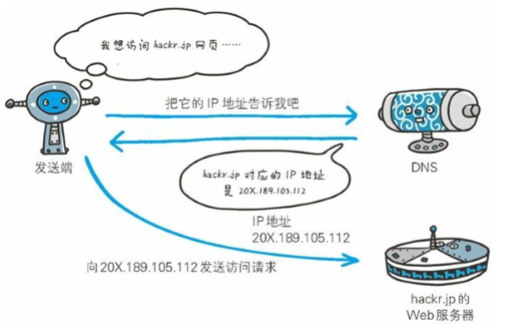
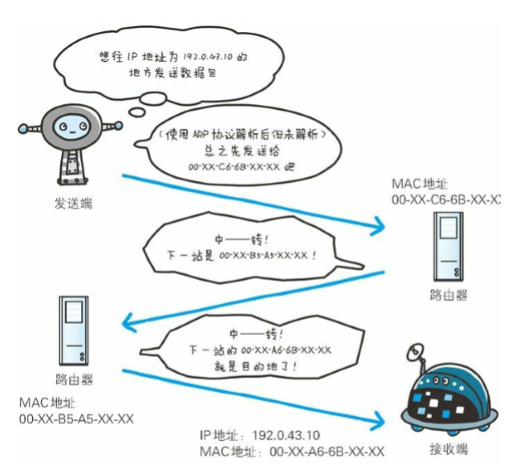

 计网面试题（一）
===

1. **OSI七层模型**：

   物理层、数据链路层、网络层、传输层、会话层、表示层和应用层。

2. **TCP/IP四层模型**：

   - 应用层：决定向用户提供应用服务时通信的活动。该层有FTP（文件传输协议）、DNS（域名系统）、HTTP（超文本传输协议）协议。

   - 传输层：对上层应用层提供处于网络连接中的两台计算机之间的数据传输。该层有TCP（传输控制协议）、UDP（用户数据报）协议。

   - 网络层：处理在网络上流动的数据包。该层有：IP（网际协议）、ARP（地址解析）协议。

   - 链路层：用来处理连接网络的硬件部分。

	

3. **HTTP**：

   - 超文本传输协议

	- 消息报头：
		- 通用报头：既可以出现在请求报头，也可以出现在响应报头中。
			1. Date：表示消息产生的日期和时间
			2. Connection：允许发送指定连接的选项，例如指定连接是连续的，或者指定“close”选项，通知服务器，在响应完成后，关闭连接
			3. Cache-Control：用于指定缓存指令，缓存指令是单向的（响应中出现的缓存指令在请求中未必会出现），且是独立的（一个消息的缓存指令不会影响另一个消息处理的缓存机制）
		- 请求报头：请求报头通知服务器关于客户端请求的信息。
			1. Host：请求的主机名，允许多个域名同处一个IP地址，即虚拟主机
			2. User-Agent：发送请求的浏览器类型、操作系统等信息
			3. Accept：客户端可识别的内容类型列表，用于指定客户端接收那些类型的信息
			4. Accept-Encoding：客户端可识别的数据编码
			5. Accept-Language：表示浏览器所支持的语言类型
			6. Connection：允许客户端和服务器指定与请求/响应连接有关的选项，例如这是为Keep-Alive则表示保持连接。
			7. Transfer-Encoding：告知接收端为了保证报文的可靠传输，对报文采用了什么编码方式。
		- 响应报头：用于服务器传递自身信息的响应。
			1. Location：用于重定向接受者到一个新的位置，常用在更换域名的时候
			2. Server：包含可服务器用来处理请求的系统信息，与User-Agent请求报头是相对应的

		- 实体报头：实体报头用来定于被传送资源的信息，既可以用于请求也可用于响应。请求和响应消息都可以传送一个实体。
			1. Content-Type：发送给接收者的实体正文的媒体类型
			2. Content-Lenght：实体正文的长度
			3. Content-Language：描述资源所用的自然语言，没有设置则该选项则认为实体内容将提供给所有的语言阅读
			4. Content-Encoding：实体报头被用作媒体类型的修饰符，它的值指示了已经被应用到实体正文的附加内容的编码，因而要获得Content-Type报头域中所引用的媒体类型，必须采用相应的解码机制。
			5. Last-Modified：实体报头用于指示资源的最后修改日期和时间
			6. Expires：实体报头给出响应过期的日期和时间

	- get和post的区别：
		- get: 从服务器获取数据，post: 向服务器传送数据
		- get传送数据量小，post传送数据量大
		- get安全性比post低
		- get执行效率比post高
	- http各版本区别：
		1. HTTP 1.0需要使用keep-alive参数来告知服务器端要建立一个长连接，而HTTP1.1默认支持长连接。
		2. HTTP 1.1支持只发送header信息(不带任何body信息)，1.0不支持。
		3. HTTP1.0是没有host域的，HTTP1.1才支持这个参数。
		4. HTTP2.0使用了多路复用的技术，做到同一个连接并发处理多个请求，而且并发请求的数量比HTTP1.1大了好几个数量级。
		5. HTTP1.1不支持header数据的压缩，HTTP2.0使用HPACK算法对header的数据进行压缩，这样数据体积小了，在网络上传输就会更快。
		6. 当我们对支持HTTP2.0的web server请求数据的时候，服务器会顺便把一些客户端需要的资源一起推送到客户端，免得客户端再次创建连接发送请求到服务器端获取。这种方式非常合适加载静态资源。

4. **HTTPS**：
	
	- HTTP的安全版，安全套接字层超文本传输协议
	
	- 如何加密：

		1. 客户端将SSL 协议的版本号、加密算法的种类，产生的随机数A等信息传给			 服务器

		2. 服务器选择其中的一种组合作为加密方式，同时将自己的证书、公钥、另外一个随机数B一起传给客户端

		3. 客户端验证客户端返回的信息（包括证书，签名，域名等），验证成功，则生成对称加密密钥S，用公钥加密后返回给服务器

		4. 服务器用私钥将这段密钥解密。得到对称密钥S，并用此密钥加密一段握手消息返回给客户端

		5. 客户端收到握手消息，用对称密钥解密，验证成功，则握手成功。

	- 与HTTP的区别：

		1. HTTP是明文传输，HTTPS用SSL加密，还可进行身份认证。

		2. 两者使用的连接方式不同，用的端口也不一样。HTTP的端口是80，HTTPS是443。

		3. HTTPS与HTTP相比起来费用高，握手阶段费时，连接缓存不够HTTP高效，连接服务端资源占用高。

		4. http的连接很简单，是无状态的；HTTPS协议是由SSL+HTTP协议构建的可进行加密传输、身份认证的网络协议，比http协议安全。

	- SSL安全机制：
		1. 身份验证机制：基于证书利用**数字签名方法**对服务器和客户端进行身份验证，其中客户端的身份验证是可选的。
		2. 数据传输的机密性：利用**对称密钥算法**对传输的数据进行加密。
		3. 消息完整性验证：消息传输过程中使用**MAC算法**来检验消息的完整性。
5. **TCP**：

   - 传输控制协议

   - 三次握手
	
		- 为什么不是两次：防止失效的连接请求报文段被服务端接收，从而产生错误。

   - 四次挥手

     						   
		- 为什么是四次：确保数据能够完成传输。当关闭连接时，当收到对方的FIN报文通知时，它仅仅表示对方没有数据发送给你了；但未必你所有的数据都全部发送给对方了，所以你可以未必会马上会关闭SOCKET,也即你可能还需要发送一些数据给对方之后，再发送FIN报文给对方来表示你同意现在可以关闭连接了，所以它这里的ACK报文和FIN报文多数情况下都是分开发送的。

   - 如何保证可靠：
		1. 等待确认、超时重传
		2. 数据合理分片
		3. 丢弃重复数据
		4. 对失序数据进行重新排序才交给应用层
		5. 差错检测：TCP将保持它首部和数据的检验和。如果收到段的检验和有差错，TCP将丢弃这个报文段和不确认收到此报文段。 
		6. 流量控制：TCP采用大小可变的滑动窗口进行流量控制，窗口大小的单位是字节。
			- 发送窗口在连接建立时由双方商定。但在通信的过程中，接收端可根据自己的资源情况，随时动态地调整对方的发送窗口上限值(可增大或减小)。
		7. 拥塞控制：
			- 慢开始和拥塞避免：慢开始的拥塞窗口是成倍增加。拥塞避免是加法增加。

			

			- 快重传和快恢复：快重传是发送方只要一连收到三个重复确认就应当立即重传对方尚未收到的报文段，而不必继续等待重传计时器到期。快恢复是当发送方连续收到三个重复确认，就执行“乘法减小”算法，把慢开始门限ssthresh减半，然后开始执行拥塞避免算法（“加法增大”）。

			

		

6. **UDP**：

   - 用户数据报协议
   - 提供面向事务的简单不可靠信息传送服务 
   - 与TCP区别：
		1. TCP是面向连接可靠的，UDP面向非连接不可靠的。
		2. TCP首部开销20字节，UDP首部开销8字节。
		3. TCP点对点连接，UDP支持一对一，一对多，多对一，多对多的通信。
		4. TCP面向字节流，UDP面向报文。
		5. TCP适用传输大量数据，UDP适用传输少量数据。
		6. TCP速度慢，UDP快。
		7. TCP对系统资源要求较多，UDP则较少。
	- 即时通讯使用UDP的优点：资源消耗小，传输速度快
7. **DNS**：

   - 域名系统
   - 提供通过域名 查找 IP 地址，或逆向从 IP 地址反查域名的服务。

	

8. **ARP**:

   - 地址解析协议
   - 一种用以解析地址的协议，根据通信方 的 IP 地址就可以反查出对应的 MAC 地址。

	
	
9. **划分子网**

	- IP子网划分实际上就是设计子网掩码的过程。
	- [如何划分子网](https://zhidao.baidu.com/question/60825218.html)
10. **用浏览器打开网页使用了哪些协议**：

